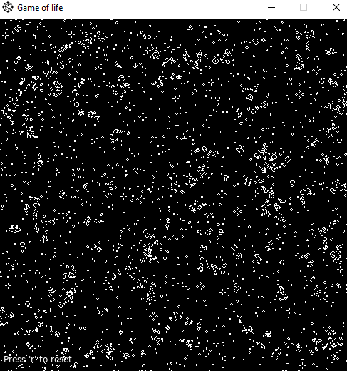

# Conway's Game of Life in Lua and Love2D
Conway's Game of Life is a cellular automaton simulation developed by mathematician John Conway. The game follows simple rules to simulate the evolution of a population of cells on a two-dimensional grid. The cells can be in one of two states: alive or dead. The game evolves based on these rules:

1. Any live cell with fewer than two live neighbors dies, as if caused by underpopulation.
1. Any live cell with two or three live neighbors lives on to the next generation.
1. Any live cell with more than three live neighbors dies, as if by overpopulation.
1. Any dead cell with exactly three live neighbors becomes a live cell, as if by reproduction.
# Getting Started
To run the Conway's Game of Life simulation, you will need the Love2D framework installed on your system. Love2D is a framework for creating 2D games and interactive applications. You can download Love2D from the official website: https://love2d.org

Once you have Love2D installed, follow these steps to run the simulation:

2. Clone this repository or download the code as a ZIP file.
2. Extract the contents of the ZIP file (if applicable).
2. Navigate to the project directory using the terminal or file explorer.
2. Run the game by dragging the project folder onto the Love2D executable or use the command love . in the terminal.
# Controls
Press 'r' to reset the simulation and generate a new random initial configuration for the cells.
# Customization
You can customize the simulation by modifying the following variables in the main.lua file:

cellSize: Adjust the size of each cell in pixels to change the level of detail and appearance of the simulation.

gridWidth, gridHeight: Change the dimensions of the grid to control the number of cells in the simulation.

grid[x][y]: Modify the initializeGrid() function to set specific patterns or initial configurations for the cells.

# License

This project is licensed under the MIT License.

# Acknowledgments
John Conway for creating the Game of Life.

Love2D developers for the Love2D framework.

# Screenshots

